# KORISNIČKI PRIRUČNIK - DECEPTION DETECTOR

**Verzija:** 1.1  
**Datum:** 2025-11-10

---

## SADRŽAJ

1. [Uvod](#1-uvod)
2. [Što je Deception Detector?](#2-što-je-deception-detector)
3. [Instalacija](#3-instalacija)
4. [Korištenje aplikacije](#4-korištenje-aplikacije)
5. [Analiza teksta](#5-analiza-teksta)
6. [Treniranje vlastitih modela](#6-treniranje-vlastitih-modela)
7. [Pristup vlastitim modelima](#7-pristup-vlastitim-modelima)
8. [Razumijevanje rezultata](#8-razumijevanje-rezultata)
9. [Rješavanje problema](#9-rješavanje-problema)
10. [Često postavljana pitanja](#10-često-postavljana-pitanja)

---

## 1. UVOD

### 1.1 Svrha priručnika

Ovaj priručnik pruža upute za korištenje **Deception Detector** aplikacije - alata za analizu vjerodostojnosti tekstualnog sadržaja. Priručnik je namijenjen krajnjim korisnicima.

## 2. ŠTO JE DECEPTION DETECTOR?

### 2.1 Opis

**Deception Detector** je web aplikacija koja koristi moderne alate i modele umjetne inteligencije za analizu teksta i detekciju potencijalno obmanjujućeg ili nevjerodostojnog sadržaja.

### 2.2 Glavne mogućnosti

✅ **Analiza teksta** - Analizirajte bilo koji tekst do 1300 znakova  
✅ **Više modela** - Odaberite između 6 pretreniranih modela  
✅ **Vlastiti modeli** - Trenirajte modele na vlastitim podatcima  
✅ **Objašnjenja odluke** - Razumijte zašto je tekst označen kao vjerodostojan ili obmanjujući  
✅ **Jednostavno dijeljenje** - Dijelite vlastite modele pomoću 6-znamenkastog koda

### 2.3 Dostupni modeli

| Model | Specijalizacija | Preporučeno za |
|-------|-----------------|----------------|
| **BERT Climate Change** | Klimatske promjene | Tekstove o klimatskim promjenama |
| **BERT COVID-19** | COVID-19 vijesti | Tekstove o zdravstvu i pandemiji |
| **BERT Combined** | Općenito | Različite teme |
| **DeBERTa Climate Change** | Klimatske promjene | Napredna analiza klime |
| **DeBERTa COVID-19** | COVID-19 vijesti | Tekstove o zdravstvu i pandemiji |
| **DeBERTa Combined** | Općenito | Različite teme |

---

## 3. INSTALACIJA

### 3.1 Preduvjeti

- Python 3.8 ili noviji
- Node.js 14 ili noviji
- Minimalno 8 GB RAM-a
- ~10 GB slobodnog prostora na disku

### 3.2 Brza instalacija (Windows)

```powershell
# 1. Setup sve dependencies
.\setup.bat

# 2. Preuzmi AI modele
.\download-models.bat

# 3. Pokreni backend (Terminal 1)
.\start-backend.bat

# 4. Pokreni frontend (Terminal 2)
.\start-frontend.bat

# 5. Otvori preglednik
# http://localhost:8080
```

### 3.3 Instalacija (Linux/macOS)

```bash
# 1. Backend setup
python3 -m venv venv
source venv/bin/activate
cd backend
pip install -r requirements.txt

# 2. Preuzmi modele
python3 ../download_models.py

# 3. Frontend setup
cd ../frontend
npm install

# 4. Pokreni aplikaciju (2 terminala)
# Terminal 1: cd backend && python app.py
# Terminal 2: cd frontend && npm run serve
```

---

## 4. KORIŠTENJE APLIKACIJE

### 4.1 Navigacija

Aplikacija ima tri glavna taba:

📊 **Analysis** - Analizirajte tekst s pretreniranim modelima  
🎯 **Fine-tuning** - Trenirajte vlastite modele  
🔑 **Model Access** - Pristupite vlastitim modelima pomoću koda

### 4.2 Prvi koraci

1. Otvorite aplikaciju u pregledniku (`http://localhost:8080 ako je lokalno podignuto`)
2. Kliknite na **Analysis** tab (već je odabran po defaultu)
3. Unesite tekst koji želite analizirati
4. Odaberite model
5. Kliknite **Analyze Text**

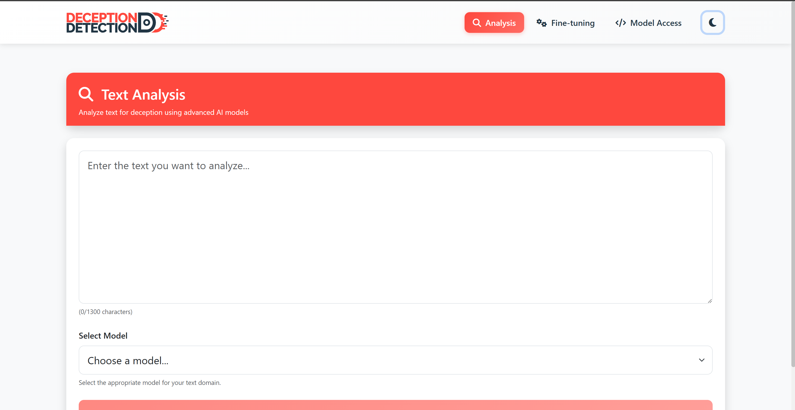
*Prikaz glavnog ekrana: logo u gornjem lijevom kutu, tri navigacijska taba (Analysis, Fine-tuning, Model Access), aktivan Analysis tab označen crvenom bojom.*

### 4.3 Tamni / svijetli način (Dark / Light mode)

Aplikacija podržava tamni i svijetli način rada. U gornjem desnom kutu nalazi se ikona (sunce / mjesec) koja prebacuje temu.

Kako koristiti:
- Kliknite ikonu sunce/mjesec u navigaciji da uključite ili isključite tamni način.
- Vaš odabir se sprema u preglednik i ostaje aktivan nakon osvježavanja stranice.
- Ako nemate spremljenu preferenciju, aplikacija koristi postavke operativnog sustava (prefers-color-scheme).

Savjet za provjeru (lokalno):
- Otvorite aplikaciju na http://localhost:8080
- Kliknite ikonu tamnog načina i promijenite temu
- Ponovo učitajte stranicu – izbor bi trebao ostati aktivan


---

## 5. ANALIZA TEKSTA

### 5.1 Unos teksta za analizu

1. Kliknite u polje za unos teksta
2. Upišite ili zalijepite tekst (do 1300 znakova)
3. Pratite brojač znakova u donjem desnom kutu

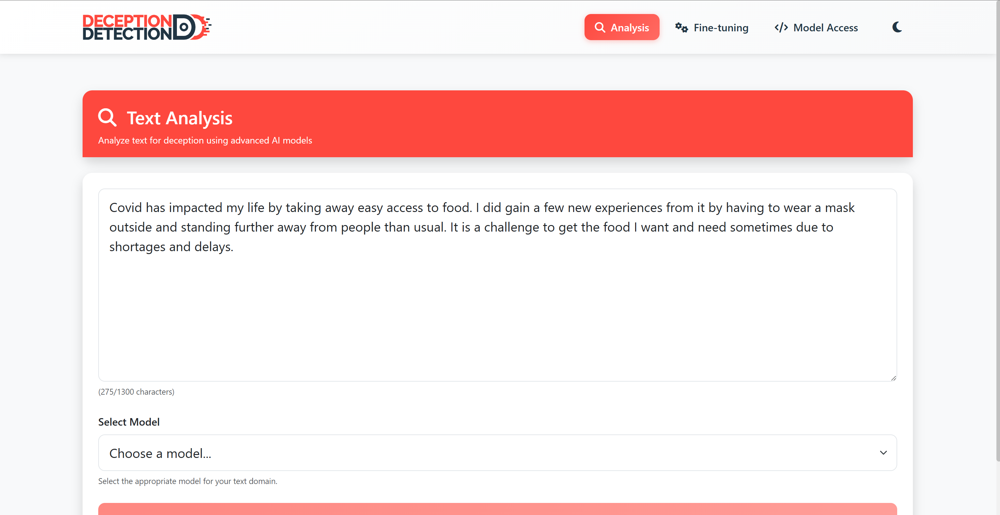
*Prikaz tekstualnog polja sa djelomično unesenim tekstom. Vidljiv brojač znakova (npr. "275/1300"), dropdown za odabir modela, i omogućen "Analyze Text" gumb.*

### 5.2 Odabir modela

Iz padajućeg izbornika odaberite model:

- Za tekstove o klimatskim promjenama → **BERT/DeBERTa Climate Change**
- Za tekstove o COVID-19 → **BERT/DeBERTa COVID-19**
- Za ostale teme → **BERT/DeBERTa Combined**

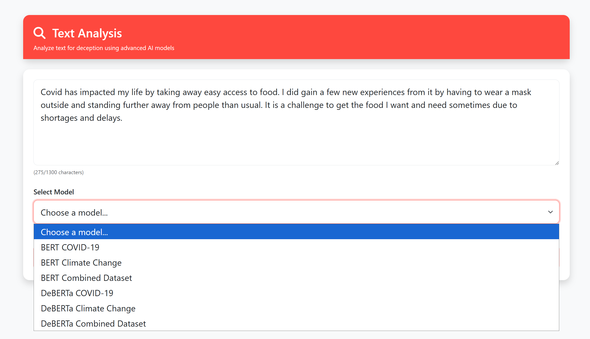
*Prikaz dropdown menija sa svim dostupnim modelima: BERT Climate Change, BERT COVID-19, BERT Combined, DeBERTa Climate Change, DeBERTa COVID-19, DeBERTa Combined.*

### 5.3 Analiza i rezultati

**Pokretanje analize:**
1. Kliknite gumb **Analyze Text**
2. Pričekajte 1-3 sekunde
3. Rezultati će se prikazati automatski

**Tumačenje rezultata:**

```
Predikcija može biti "Truthful" (vjerodostojan) ili "Deceptive" (obmanjujući). Model također prikazuje "Confidence" - postotak sigurnosti u svoju odluku
```

**Što znače postoci?**

| Confidence | Značenje | Akcija |
|------------|----------|--------|
| 90-100% | Vrlo visoka sigurnost | Možete vjerovati rezultatu |
| 70-89% | Visoka sigurnost | Rezultat je pouzdan |
| 50-69% | Umjerena sigurnost | Provjerite dodatno |
| < 50% | Niska sigurnost | Koristite drugi model |

### 5.4 Primjeri

**Primjer 1: Vjerodostojan tekst**
```
Tekst: "Covid has impacted my life by taking away easy access to food. I did gain a few new experiences from it by having to wear a mask outside and standing further away from people than usual. It is a challenge to get the food I want and need sometimes due to shortages and delays."

Rezultat: ✅ Truthful (86.1%)
```

**Primjer 2: Obmanjujući tekst**
```
Tekst: "Climate change is a hoax invented by scientists to 
get research funding."

Rezultat: ⚠️ Deceptive (85.0%)
```

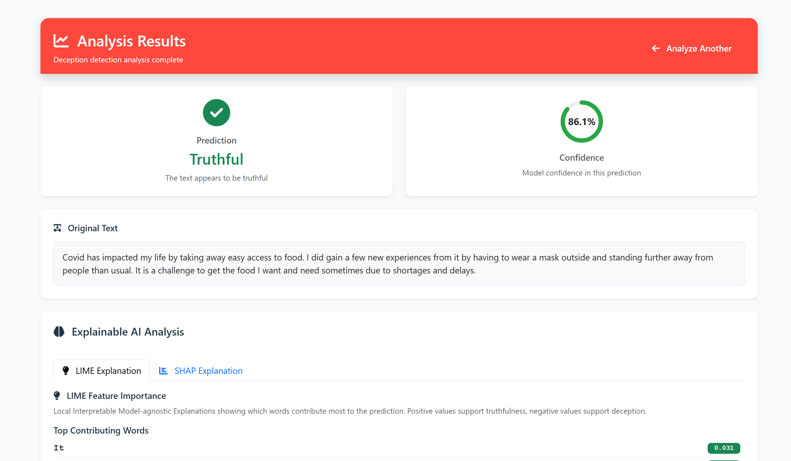
*Rezultat za vjerodostojan tekst: zeleni ◉ Truthful 86.1%. Prikazan originalni tekst i LIME/SHAP objašnjenja.*

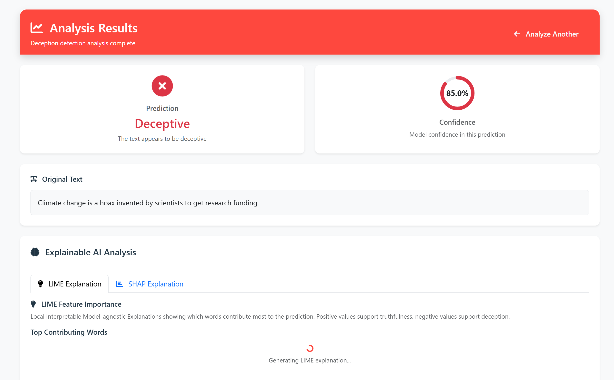
*Rezultat za obmanjujući tekst: crveni ◉ Deceptive 85.0%*

---

## 6. TRENIRANJE VLASTITIH MODELA

### 6.1 Zašto trenirati vlastiti model?

- 🎯 **Specijalizacija** - Prilagodite model svojoj specifičnoj domeni
- 📊 **Bolji rezultati** - Veća točnost na vašim podatcima
- 🔒 **Privatnost** - Vaši podatci ostaju kod vas

### 6.2 Priprema podataka

**Format CSV datoteke:**

```csv
text,label
"Ovo je vjerodostojan tekst.",truthful
"Ovo je obmanjujući tekst.",deceptive
"Još jedan vjerodostojan primjer.",truthful
```

**Pravila:**
- ✅ CSV format s dvije kolone: `text` i `label`
- ✅ Minimalno 100 primjera (preporučeno 500+)
- ✅ Balansirana distribucija poželjna i preporučena (~50% truthful, ~50% deceptive)
- ✅ Maksimalna veličina datoteke: 100 MB
- ❌ Prazni redovi nisu dozvoljeni
- ❌ Tekst ne smije biti duži od 1300 znakova

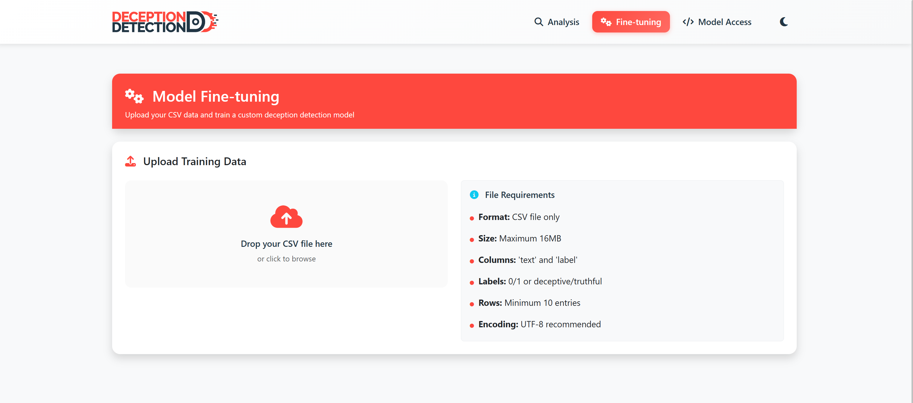
*Drag & drop zona sa "Browse files" gumbom.

### 6.3 Upload CSV datoteke

**Korak 1: Odaberite Fine-tuning tab**

**Korak 2: Upload datoteke**
- Kliknite **Browse files** ili
- Povucite CSV datoteku u drag & drop zonu

**Korak 3: Validacija**
Aplikacija će automatski provjeriti datoteku i prikazati informacije o podacima:
- Broj primjera
- Stupce
- Raspodjelu labela

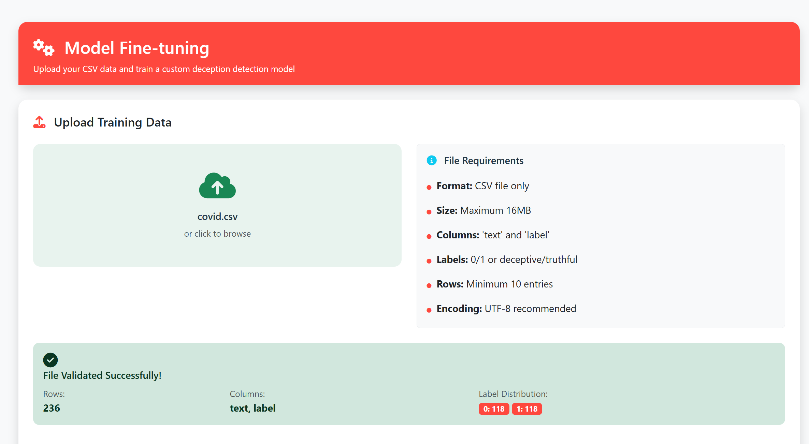
*Prikaz validacije podataka: Broj primjera: 236, Stupci: text, label, Raspodjela: Truthful: 118 (50%), Deceptive: 118 (50%).*

### 6.4 Konfiguracija treniranja

**Odabir base modela:**
- *BERT-base-uncased* 
- *DeBERTa-v3-base*
- *RoBERTa-base*
- *Albert-base-v2*
- *DistilBERT-base-uncased*

**Ime modela:**
- Unesite opisno ime za vaš model
- Koristit će se za identifikaciju modela

**Training parametri:**

| Parametar | Raspon | Default | Opis |
|-----------|--------|---------|------|
| **Epochs** | 1-10 | 3 | Broj prolazaka kroz podatke |
| **Batch Size** | 4-32 | 16 | Broj uzoraka po iteraciji |
| **Learning Rate** | Custom input | 2e-5 | Brzina učenja (unesite željenu vrijednost, npr. 0.00002) |
| **Validation Split** | 10-30% | 20% | Postotak podataka za validaciju |

**Preporuke:**
- Više epoha = bolja točnost, ali duže treniranje
- Learning rate: tipično između 1e-6 (0.000001) i 1e-2 (0.01)

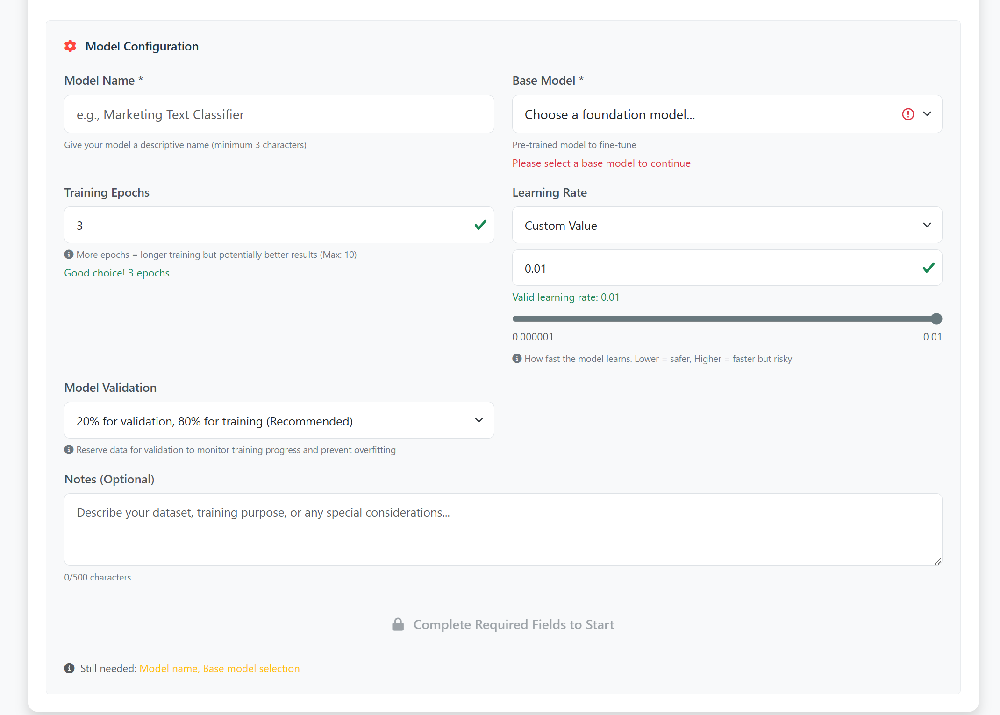
*Forma sa svim parametrima: Model Name input, Base Model dropdown, broj epoha, batch size slider (4-32), learning rate input, Validation Split dropdown.*

### 6.5 Pokretanje treniranja

**1. Kliknite "Start Training"**

**2. Spremite svoj 6-znamenkasti kod!**

**⚠️ VAŽNO:** Ovaj kod je jedini način za pristup vašem modelu!

**3. Pratite progres**

Tijekom treniranja vidjet ćete podatke o svom modelu.

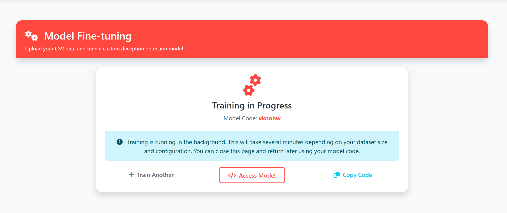

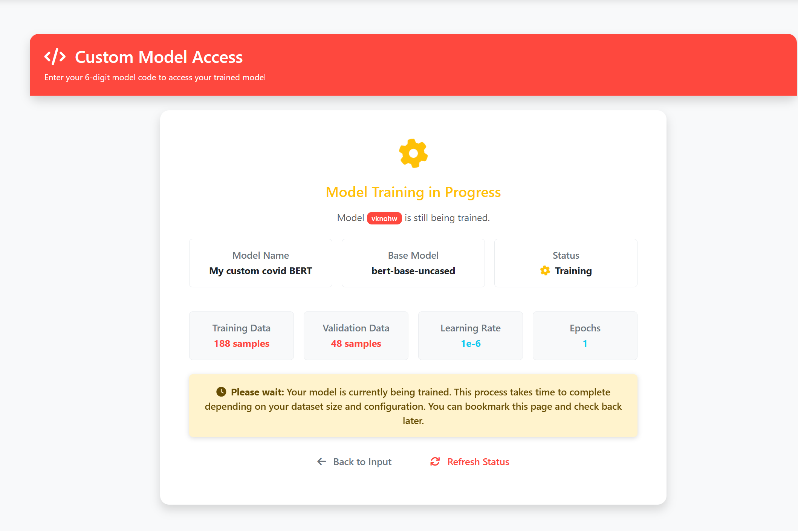
*Detaljan prikaz treniranja podatka o treniranju.*

**4. Čekanje završetka**

Vrijeme treniranja može varirati od nekoliko minuta do čak i iznad jednog sata, ovisno o veličini dataseta i odabranim parametrima.

**Brzina ovisi o:**
- GPU vs CPU (GPU je 10-20x brži)
- Veličini dataseta
- Broju epoha
- Base modelu

### 6.6 Završetak treniranja

Kada je treniranje gotovo, nakon osvježavanja statusa, otvorit će se ekran s informacijama o modelu istovjetan onom na Screenshotu 10.

**Sljedeći koraci:**
- Kopirajte model code
- Kliknite **Model Access** za testiranje modela
- Model će biti dostupan 7 dana

---

## 7. PRISTUP VLASTITIM MODELIMA

### 7.1 Unos koda

**1. Kliknite na "Model Access" tab**

**2. Unesite 6-znamenkasti kod**

**3. Kliknite "Access Model"**

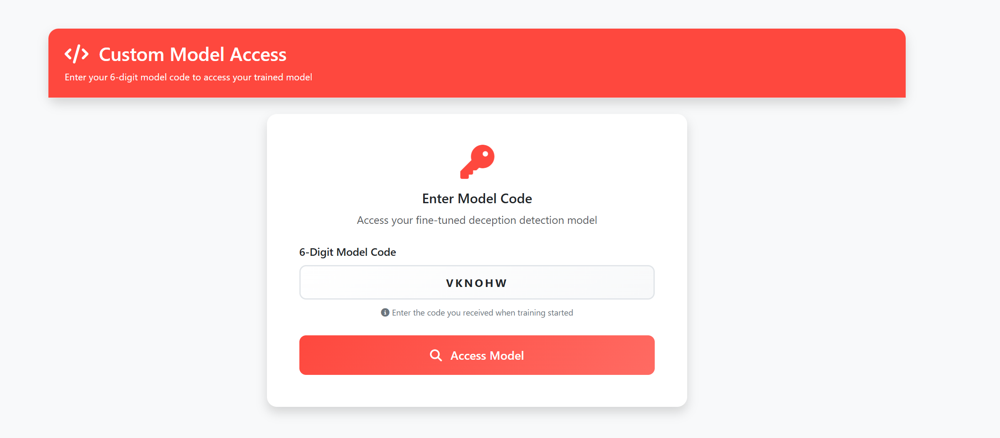
*Input polje za unos model koda (npr. "abc123") i gumb "Access Model".*

### 7.2 Informacije o modelu

Nakon uspješnog pristupa (ispravnog unosa koda), vidjet ćete stranicu koja prikazuje detalje o vašem modelu:
```
- Ime modela
- Base model
- Bilješke
- Broj epoha
- Validacijska točnost
- Preostalo vrijeme do brisanja modela
```

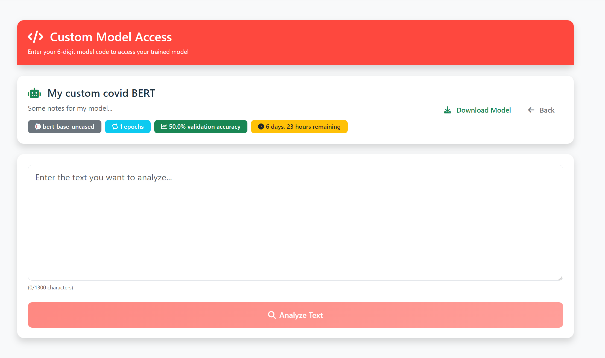
*Prikaz informacija o modelu i sučelje za unos teksta za analizu.*

### 7.3 Korištenje vlastitog modela

**Analiza teksta:**
1. Kliknite **Analyze Text**
2. Unesite tekst koji želite analizirati
3. Kliknite **Analyze**
4. Rezultati će biti prikazani kao i kod pretreniranih modela

### 7.4 Preuzimanje modela

**Zašto preuzeti model?**
- 💾 Sigurnosna kopija (model se briše nakon 7 dana)
- 📤 Dijeljenje s kolegama
- 🔄 Korištenje u drugim aplikacijama

**Kako preuzeti:**

**1. Kliknite "Download Model"**

**2. Pratite progress:**

**3. Spremite ZIP datoteku**

Datoteka će se preuzeti kao: `deception_model_abc123.zip`

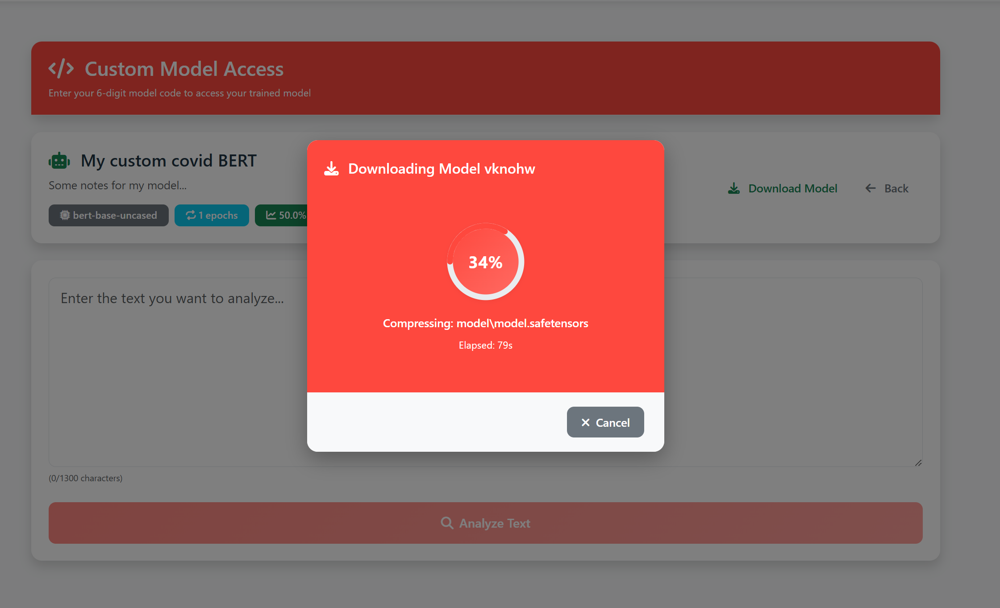
*Prikazivanje postotka kreacije .zip arhive modela.*

### 7.5 Rok trajanja modela

⚠️ **Vlastiti modeli se automatski brišu nakon 7 dana!**

**Preostalo vrijeme vidite u model info:**

**Što učiniti:**
- Preuzmite model prije isteka roka
- Ili ga ponovno trenirajte i pristupite kroz novi kod

---

## 8. RAZUMIJEVANJE REZULTATA

### 8.1 LIME objašnjenja

**Što je LIME?**
LIME (Local Interpretable Model-agnostic Explanations) pokazuje koje riječi su najviše utjecale na odluku modela.

**Kako čitati LIME vizualizaciju:**

- Riječi označene crvenom bojom doprinose odluci "Deceptive"
- Riječi označene zelenom bojom doprinose odluci "Truthful"
- Prikazani brojevi pokazuju koliko svaka riječ doprinosi konačnoj odluci - veći broj = veći utjecaj

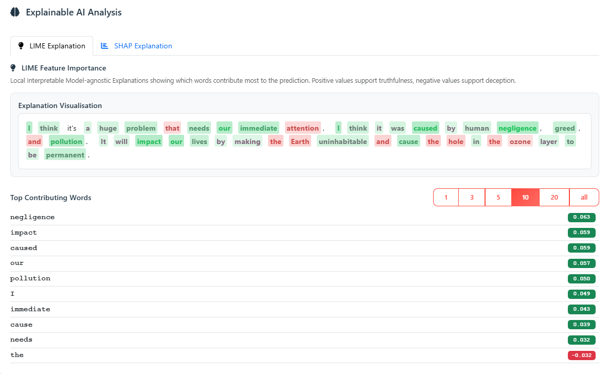

### 8.2 SHAP objašnjenja

**Što je SHAP?**
SHAP (SHapley Additive exPlanations) koristi game theory za objašnjenje važnosti riječi.

**Kako čitati SHAP vizualizaciju:**

Čitanje SHAP vizualizacije gotovo je identično kao i kod LIME:
- Riječi s pozitivnim SHAP vrijednostima (zelene) doprinose odluci "Truthful"
- Riječi s negativnim SHAP vrijednostima (crvene) doprinose odluci "Deceptive"
- Koeficijent pokazuje koliko svaka riječ utječe

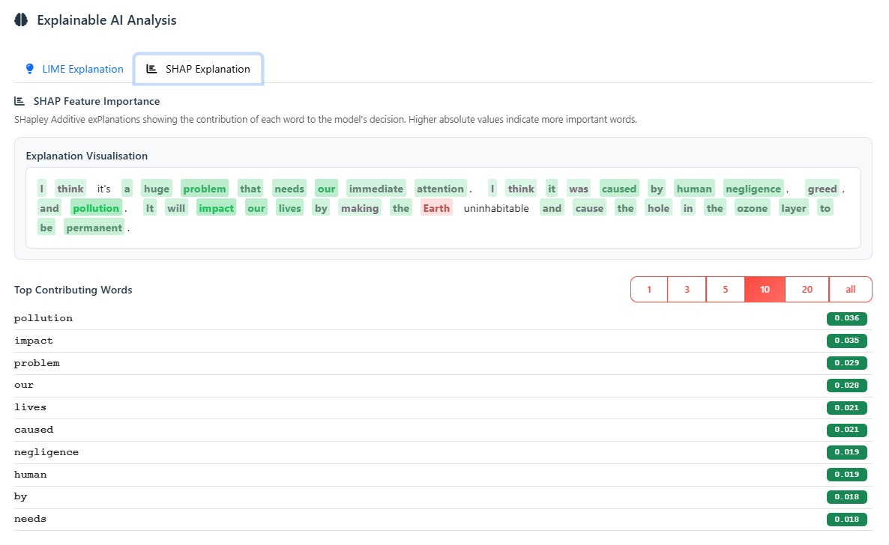
*Bar chart sa SHAP vrijednostima za riječi koje doprinose odluci "Truthful".*

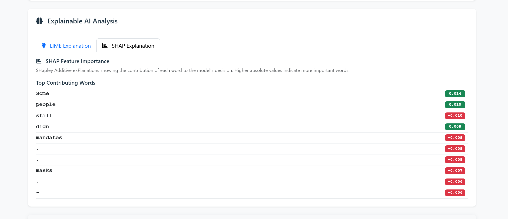
*Bar chart sa SHAP vrijednostima za riječi koje doprinose odluci "Deceptive".*

## 9. RJEŠAVANJE PROBLEMA

### 9.1 Aplikacija se ne pokreće

**Problem:** Backend se ne pokreće

**Rješenja:**
1. Provjerite je li Python instaliran: `python --version`
2. Aktivirajte virtualenv:
   ```powershell
   .\venv\Scripts\Activate.ps1
   ```
3. Provjerite je li port 5000 slobodan:
   ```powershell
   netstat -ano | findstr :5000
   ```

**Problem:** Frontend se ne pokreće

**Rješenja:**
1. Provjerite je li Node.js instaliran: `node --version`
2. Reinstalirajte dependencies:
   ```bash
   cd frontend
   rm -rf node_modules
   npm install
   ```

### 9.2 Greška "CUDA out of memory"

**Što učiniti:**
1. Zatvorite aplikaciju
2. Otvorite `backend/config.py`
3. Promijenite liniju:
   ```python
   DEVICE = 'cpu'  # Umjesto 'cuda'
   ```
4. Ili smanjite batch size na 8 ili 4

### 9.3 Modeli se ne preuzimaju

**Problem:** Download modela traje predugo ili pada

**Rješenja:**
1. Provjerite internet vezu
2. Ponovno pokrenite download:
   ```bash
   python download_models.py
   ```
3. Download će nastaviti od mjesta gdje je stao

### 9.4 "Model not found" greška

**Uzroci:**
- ❌ Pogrešan kod (provjerite tipfeler)
- ❌ Model je istekao (više od 7 dana)
- ❌ Model je obrisan zbog čišćenja

**Što učiniti:**
- Ponovno trenirajte model s istim podatcima

### 9.5 CSV upload ne radi

**Česte greške:**

| Greška | Uzrok | Rješenje |
|--------|-------|----------|
| "Invalid CSV format" | Pogrešan format | Provjerite da imate `text,label` header |
| "File too large" | > 100 MB | Smanjite broj primjera |
| "Empty file" | Nema podataka | Provjerite sadržaj datoteke |
| "Missing label column" | Nema `label` kolone | Dodajte `label` kolonu |

**Primjer ispravnog CSV-a:**
```csv
text,label
"Tekst 1",truthful
"Tekst 2",deceptive
```

### 9.6 Rezultati izgledaju čudno

**Problem:** Model daje neočekivane rezultate

**Mogući uzroci:**
1. **Pogrešan model** - Koristite model specijaliziran za vašu domenu
2. **Tekst prekratak** - Minimalno 20-30 riječi
3. **Tekst predugačak** - Maksimalno 1300 znakova
4. **Miješani jezik** - Modeli su trenirani na engleskom

**Što učiniti:**
- Probajte drugi model
- Reformulirajte tekst
- Provjerite LIME/SHAP za razumijevanje

### 9.7 Frontend ne vidi backend

**Greška u konzoli:** "Network Error" ili "CORS policy"

**Rješenje:**
1. Provjerite je li backend pokrenut na portu 5000
2. Otvorite http://localhost:5000/api/models u pregledniku
3. Trebali biste vidjeti JSON s modelima

Ako ne radi:
- Restartajte backend
- Provjerite firewall postavke

---

## 10. ČESTO POSTAVLJANA PITANJA

### 10.1 Općenito

**P: Mogu li koristiti aplikaciju offline?**  
O: Da, nakon što preuzmete modele, aplikacija radi potpuno offline.

**P: Podržava li aplikaciju druge jezike osim engleskog?**  
O: Trenutno ne. Modeli su trenirani isključivo na engleskim tekstovima.

**P: Koliko teksta mogu analizirati?**  
O: Maksimalno 1300 znakova (~200 riječi) po analizi.


### 10.2 Modeli

**P: Koji je najbolji model?**  
O: Ovisi o sadržaju:
- Za klimatske promjene: **Pretrenirani modeli na skupovima podataka o klimatskim promjenama**.
- Za COVID-19: **Pretrenirani modeli na COVID-19 vijestima**.
- Za općenite teme: **Combined modeli ili custom trenirani modeli**.

**P: Mogu li koristiti model na drugim jezicima?**  
O: Ne, modeli su trenirani samo na engleskom.

### 10.3 Treniranje

**P: Koliko primjera trebam za treniranje?**  
O: Minimalno 100, ali preporučujemo 500+ za dobre rezultate.

**P: Koliko dugo traje treniranje?**  
O: Može varirati od nekoliko minuta do nekoliko sati, ovisno o veličini dataseta i parametrima.

**P: Trebam li GPU?**  
O: Ne, ali GPU značajno ubrzava treniranje.

**P: Mogu li zaustaviti treniranje?**  
O: Ne, treniranje mora završiti do kraja. Progress se ne sprema.

**P: Što ako ugasim backend aplikaciju tijekom treniranja?**  
O: Treniranje će se prekinuti i morat ćete početi ispočetka.

### 10.4 Vlastiti modeli

**P: Koliko dugo je model dostupan?**  
O: 7 dana od završetka treniranja.

**P: Mogu li produljiti rok trajanja?**  
O: Ne, ali možete preuzeti model.

**P: Što ako zaboravim kod?**  
O: Nažalost, nema načina za oporavak. Treba ponovno trenirati model.

**P: Mogu li dijeliti kod s drugima?**  
O: Da, svatko s kodom može pristupiti modelu.

**P: Koliko modela mogu trenirati?**  
O: Nema limita, ali maksimalno 100 aktivnih modela može postojati istovremeno u sustavu.

### 10.5 Sigurnost i privatnost

**P: Mogu li drugi vidjeti moje modele?**  
O: Ne, osim ako im ne date 6-znamenkasti kod.

**P: Što se događa s mojim CSV podacima nakon uploada?**  
O: Brišu se automatski nakon završetka treniranja.

**P: Je li aplikacija sigurna?**  
O: Da, nema vanjske komunikacije i nema autentifikacije (nema user accounta).

---

## 11. DODATAK

### 11.1 Tehnički zahtjevi

**Minimum:**
- CPU: 4 cores
- RAM: 8 GB
- Disk: 10 GB
- OS: Windows 10, macOS 10.14, Linux (Ubuntu 18.04+)

**Preporučeno:**
- CPU: 8+ cores
- RAM: 16 GB
- GPU: NVIDIA s 8 GB+ VRAM
- Disk: 50 GB SSD

### 11.2 Ograničenja

**Tekst:**
- Maksimalno 1300 znakova po analizi
- Samo engleski jezik
- Minimum ~20 riječi za pouzdane rezultate

**Treniranje:**
- CSV datoteka do 100 MB
- Minimalno 100 primjera
- Maksimalno 10 epoha

**Modeli:**
- Zadržavaju se 7 dana
- Maksimalno 100 aktivnih modela u sustavu

### 11.3 Pojmovnik

| Pojam | Objašnjenje |
|-------|-------------|
| **Truthful** | Vjerodostojan, istinit sadržaj |
| **Deceptive** | Obmanjujući, lažan sadržaj |
| **Confidence** | Sigurnost modela (0-100%) |
| **BERT** | AI model za razumijevanje teksta |
| **DeBERTa** | Napredna verzija BERT-a (točnija) |
| **Fine-tuning** | Treniranje modela na vlastitim podatcima |
| **Epoch** | Jedan prolazak kroz sve podatke |
| **Validation** | Testiranje točnosti modela |
| **LIME** | Metoda za objašnjavanje rezultata |
| **SHAP** | Napredna metoda za objašnjavanje |
